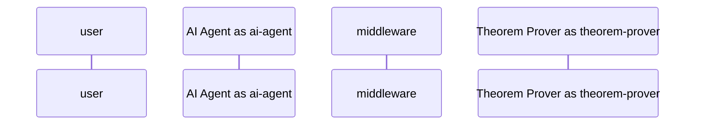
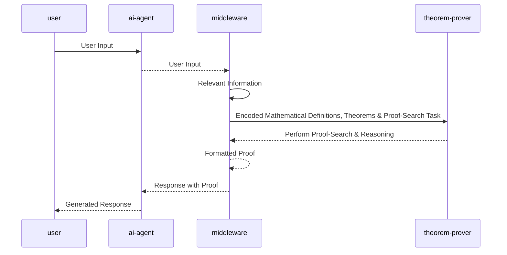

# LeanGPT

## Brainstorming an Abstract & Features

The idea is to use LLM agents<->Theorem provers pipeline for:

- **AI-assisted Proof Generation & Interpretation:**
    - allow users to input natural language proofs, which are then processed by a Middleware/Backend service that interfaces the AI agent with the Theorem Prover agent.
    - improve the interpretability of the Theorem Prover's results and translated them back to natural language
    - provide proof-assistance, ai-assisted debugging
    - to investigate further: would something like [AutoGPT](https://github.com/Significant-Gravitas/Auto-GPT) be useful to partially automate [1] the proof generation / drafting&sketching&refining proof feeds to be passed&validated to the Theorem Prover?

- **AI-assisted Math Proof Search Engine:**
    - allows users to write natural language queries to look for theorems & proofs
    - provide interpretability for the search results
    - provide autocomplete feature

[1] the word `automate` is used with a grain of salt here because 1) LLMs are currently not quite good at math, they are trained on informal mathematical data and tend to produce a high rate of erroneous proofs & math results due to their reasoning limitations when dealing with complex propositional logic & formal languages/systems 2) the concept of `automation` finds its theoretical limitations in the case of **automated theorem prover** using a formal system like [Peano Arithmetic](https://plato.stanford.edu/entries/logic-provability/#ProvLogiPeanArit) due to [goedel incompleteness theorems](https://plato.stanford.edu/entries/goedel-incompleteness/) - and if i'm talking rubbish feel to open a PR. long story short by `automation` here I mean setting a goal and repeating the procedure of suggesting new informal problem solving pathways until said goal is reached.

## Sequence Diagram

Just for starters, the **AI agent** is GPT3, the **Theorem Prover** entity are COQ and the Lean theorem prover. The backend/middleware entity might be a basic flask API (TBD), but it could be replaced later with Langchain to experiment with interoperability.

## State Machine Diagram

<!--[State Diagram](./puml-diagrams/state-machine-diagram.puml)-->

## Neat resources
- [Draft, Sketch, and Prove: Guiding Formal Theorem Provers with Informal Proofs
](https://arxiv.org/abs/2210.12283)
- [Wolfram|Alpha as the Way to Bring Computational Knowledge Superpowers to ChatGPT](https://writings.stephenwolfram.com/2023/01/wolframalpha-as-the-way-to-bring-computational-knowledge-superpowers-to-chatgpt/)
- [deepmath](https://github.com/tensorflow/deepmath)
- [Theorem Proving in Lean](https://leanprover.github.io/theorem_proving_in_lean/)
- [The Future of Mathematics?](https://www.youtube.com/watch?v=Dp-mQ3HxgDE)
